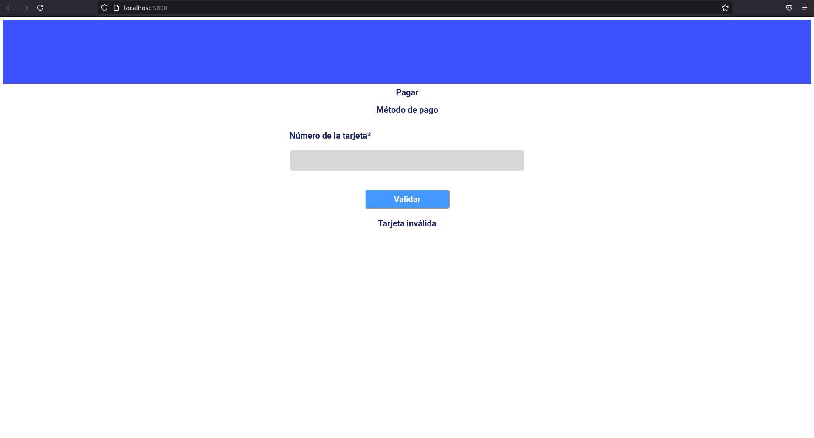
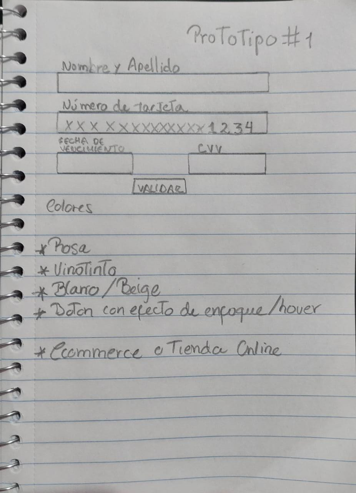
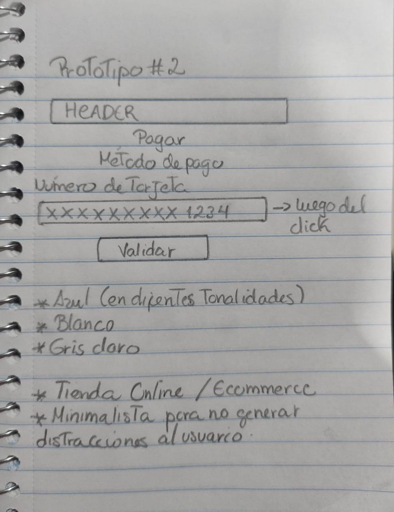
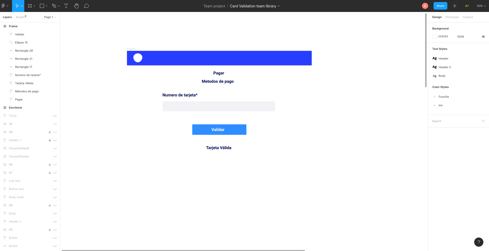

# Tarjeta de crédito válida

Esta aplicación esta desarrollada con la finalidad de validar si un numero de tarjeta es o no correcto. Se ha tomado como estrategia de la logica de la misma, la implementacion del algoritmo de LUHN.

# Imagen final del proyecto

# Investigación UX

El publico objetivo al que va dirigido la aplicacion son usuarios que se encuentran realizando compras en una tienda online / Ecommerce donde van a verificar si la tarjeta usada es valida para continuar con el proceso de compra.

# Prototipo de Baja Fidelidad Version 1.

# Prototipo de Baja Fidelidad Version 2.

Se pidio feedback y se realizo un reasjuste a ciertas secciones que no eran necesarias para los propositos de desarrollo. Asi como el color original pensado para evitar distracciones que se viera mas limpia la pantalla.

# Imagen del prototipo final

